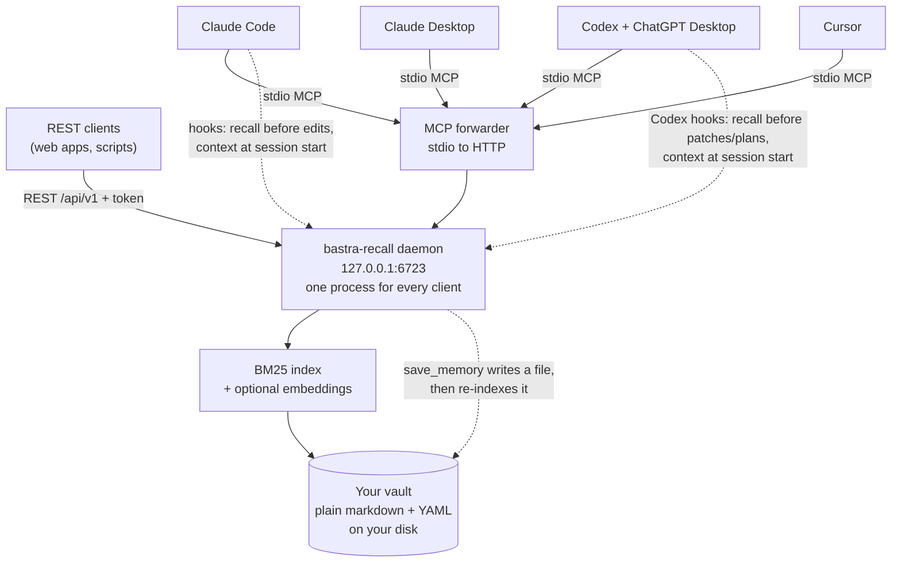
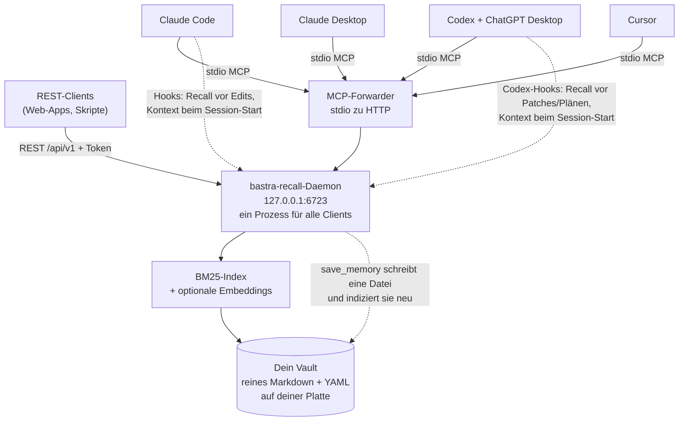

<p align="center">
  
</p>

# Bastra.Recall

> A persistent teammate memory for your AI assistants — one local vault, shared by every tool that speaks MCP.
> Ein persistentes Teammate-Gedächtnis für deine AI-Assistenten — ein lokaler Vault, geteilt von jedem Tool, das MCP spricht.

[](https://bastra.io)
[](https://discord.gg/5yNaXsRhWB)
[](./LICENSE)
[](https://github.com/n0mad-ai/bastra-recall/stargazers)
[](https://github.com/n0mad-ai/bastra-recall/issues)
[](https://github.com/n0mad-ai/bastra-recall/commits/main)
[](https://www.typescriptlang.org/)
[](https://modelcontextprotocol.io/)
[](https://github.com/sponsors/n0mad-ai)

---

## 🇬🇧 English

**What it is** — A long-term memory for your AI assistant. Whenever you correct it, state a rule, or commit to a decision, it gets saved as a small note. In your next chat — days or weeks later — the AI pulls those notes back automatically. No more repeating yourself. Everything stays on your own Mac as plain Markdown files (Obsidian-compatible), and every connected tool shares the same memory at the same time. Today that includes **Claude Code, Claude Desktop, Codex, and the ChatGPT desktop app** — see the support matrix below for what's wired and what's next.

**Status** — 🟢 Early beta, `v0.9.x`. v0.9 "Honest numbers, nothing silently lost" is out — 45 issues against the class of bug where nothing fails, nothing is logged, and the number you are shown is not true. Next is the V1.0 release contract: a reproducibly measured, selective, controllable recall base, fully specified. See [PLAN.md](./PLAN.md).

### Supported surfaces

| Surface | Status | Notes |
|---|---|---|
| **Claude Code** | ✅ tested — in daily use | MCP + Skill + seven quiet hooks + statusline |
| **Claude Desktop** | ✅ tested | MCP + Skill, autonomous session context without hooks; `.mcpb` double-click extension |
| **Codex + ChatGPT Desktop** | ✅ implemented for v1.0 | one shared local MCP config + Skill + seven Codex-native quiet hooks; `bastra install codex` |
| **Cursor** | 🟡 implemented | installs and registers cleanly; implemented, but not yet field-tested |
| **ChatGPT** (Custom GPT Actions) | 🗺️ planned | the REST gateway and an OpenAPI starter spec ship today; the packaged Custom-GPT action is next in line — tracked in [#13](https://github.com/n0mad-ai/bastra-recall/issues/13) |

Anything else that speaks MCP can attach through the forwarder today — untested surfaces are exactly that, and field reports are welcome. Non-MCP clients can use the REST API (`docs/USAGE.md`).

### Why

Working with an AI assistant over months means re-explaining the same things. Pitfalls it already learned in one project recur in the next. Stable preferences (*"give me a recommendation, not a 5-option menu"*) get forgotten between sessions. Project-specific facts get re-discovered every time.

Most AI tools have memory features, but they're **passive**: a static index file at best, no proactive recall, no cross-surface continuity.

The cost isn't just frustration — it's that the user ends up thinking *for* the AI. *"Wait, didn't we solve this last week?"* That's the bug.

### What bastra-recall does

A persistent memory layer that:

- **Saves autonomously** — when a lesson is learned (frustration, repeated correction, durable preference, finalized decision), the AI writes it to the vault without being asked. Trigger discipline ships as a shared ChatGPT/Codex/Claude Skill; client-native hooks add the reflex layer where supported.
- **Recalls before acting** — not only when the user prompts. The AI is instructed to query the vault before writing code, before plans, and at session start. The highest-weighted search field is `recall_when`, declared at save time.
- **Works across surfaces** — one local daemon serves all your connected AI tools at once, over MCP or HTTP. One vault, one index, shared state (see the support matrix above).
- **Plain markdown, Obsidian-compatible** — the vault is a folder of `.md` files with YAML frontmatter. Edit in Obsidian, in the AI, or by hand. Vaults on Google Drive / iCloud / Dropbox mounts are supported via automatic polling-mode in the file watcher.

<p align="center">
  
  <br/>
  <sub><em>An autonomous save: the AI spots a recurring pattern (here the third occurrence), records the lesson itself and weights it by salience — you just see the one-line confirmation, no prompting needed.</em></sub>
</p>

### The single success metric

> **The user doesn't have to think for the AI anymore.**

If recurring mistakes still recur, if the user still has to re-state preferences each session — the project failed, regardless of how clean the architecture is.

### How it works



Everything above runs on your machine. Nothing leaves it unless you point a tunnel at the REST gateway yourself. Recall is hybrid — an in-memory BM25 index (with `recall_when` weighted highest) plus an optional local embedding pass, fused via RRF. In Claude Code and Codex/ChatGPT desktop, seven quiet hooks recall before edits or patches, at session start, before plans, before a claim about measured project state goes into text someone else reads, and after failed commands.

Details: [docs/architecture.md](./docs/architecture.md) · [docs/hooks.md](./docs/hooks.md) · [docs/triggers.md](./docs/triggers.md) · [docs/USAGE.md](./docs/USAGE.md).

### Memory shape

Each memory is a markdown file with structured frontmatter:

```yaml
---
id: css-input-focus-ring-stacking
title: "Don't stack focus styles on inputs"
type: lesson
summary: "Stacking ring + outline + custom :focus on nested inputs causes double focus rings. Use single :focus-visible."
topic_path: [css, input, focus]
tags: [css, input, focus-ring, ui-bug]
scope: all-projects
recall_when:
  - creating new input component
  - writing input or form css
  - focus or accessibility styling
related: [css-effects-stacking-antipattern]
source: "carnexus, recurring lesson"
confidence: 0.95
---
```

The `recall_when` field is the bridge between save and recall: when saving, the AI declares the contexts under which future sessions should be reminded. Full field semantics and examples: [docs/memory-schema.md](./docs/memory-schema.md).

### Install

#### A) One command — easiest, for non-coders

```bash
curl -fsSL https://bastra.io/install | bash
```

Paste it into Terminal, press Return, answer the setup questions. It installs Homebrew if it's missing, adds the bastra tap, installs `bastra-recall`, and hands over to the guided setup — no terminal knowledge beyond pasting one line. Then restart Claude Code / Claude Desktop / Codex / ChatGPT Desktop / Cursor. To read the script before running it, open [bastra.io/install](https://bastra.io/install); it is the same file as [`distribution/install.sh`](./distribution/install.sh).

**Alternative — double-click.** Download **Install Bastra.command** from the [latest GitHub release](https://github.com/n0mad-ai/bastra-recall/releases/latest), then **right-click → Open** and confirm the dialog. A plain double-click does *not* work: macOS quarantines every browser download, so Gatekeeper blocks it. If macOS then refuses with a permissions error, the download also lost its executable bit — `chmod +x ~/Downloads/Install*.command` restores it. The same applies to **Uninstall Bastra.command**, which unregisters every client and stops the daemon, never deleting a memory.

#### B) npm or from source — for developers

```bash
npx bastra-recall install           # zero-install: guided setup with selection lists
# or:
npm install -g bastra-recall && bastra install
# or from source (Node 22+, Git):
git clone https://github.com/n0mad-ai/bastra-recall.git && cd bastra-recall
npm install && npm run build
node packages/daemon/dist/cli.js install all --vault /abs/path/to/your/vault
```

`bastra doctor` checks (and `--fix` repairs) every registration. Every config write is idempotent, atomic, backed up, and parse-safe — details in [docs/USAGE.md](./docs/USAGE.md).

#### C) Fully manual — fallback

Add the MCP forwarder block to your client's config by hand: [docs/USAGE.md](./docs/USAGE.md#fully-manual-install--fallback).

### Semantic recall (optional)

BM25 keyword search is the always-on default; a local embedding pass joins in once a provider is set up — one command, fully reversible:

```bash
bastra embeddings on       # installs Ollama (if missing), pulls the model, persists the choice
bastra embeddings off      # back to BM25 keyword-only — nothing breaks
```

Details and system requirements: **[System Requirements](https://github.com/n0mad-ai/bastra-recall/wiki/System-Requirements)** (wiki).

### Everything else, in one place

- **Cookbook — a working week with a memory:** [docs/USAGE.md](./docs/USAGE.md#cookbook)
- **Valence & reflex** — memories with emotional charge that age slower and can self-inject on hard trigger matches: [wiki](https://github.com/n0mad-ai/bastra-recall/wiki/Valence-and-Reflex)
- **Self-learning taxonomy** — the vault grows its own folder conventions: [docs/taxonomy.md](./docs/taxonomy.md)
- **Vault map** — your vault as a navigable universe, with live mode and a local search copilot: [wiki](https://github.com/n0mad-ai/bastra-recall/wiki/Vault-Map)
- **Bastra Commons (beta)** — a community vault of verified engineering recipes as a second, read-only recall source: [wiki](../../wiki/Bastra-Commons)
- **Product docs** — living user-facing documentation per project, updated by the agent: [wiki](https://github.com/n0mad-ai/bastra-recall/wiki/Product-Docs)
- **Claude Desktop autonomy** — memory without hooks, via server instructions + first-call session context: [wiki](https://github.com/n0mad-ai/bastra-recall/wiki/Claude-Desktop)
- **Codex + ChatGPT desktop** — shared config, native hooks, skill and plugin: [docs/CODEX.md](./docs/CODEX.md)
- **Onboarding & import** — five-minute warm start, and `bastra import` for ChatGPT/Claude/Gemini exports, rules files, and whole memory folders: [docs/USAGE.md](./docs/USAGE.md#importing-memories--skip-the-cold-start)
- **Vault care** — flag stale memories on the map, groom them with your next session: [docs/USAGE.md](./docs/USAGE.md#vault-care--flag-it-now-groom-it-later)
- **Updating** — `bastra update`, or hands-off with `update.mode auto`: [wiki](https://github.com/n0mad-ai/bastra-recall/wiki/Updating)
- **Cursor rules, shell completion, feedback:** [docs/USAGE.md](./docs/USAGE.md)
- **REST API** for non-MCP clients (token, CORS, tunnel setup): [docs/USAGE.md](./docs/USAGE.md#rest-api-for-non-mcp-clients) · [docs/openapi.yaml](./docs/openapi.yaml)
- **Troubleshooting:** [docs/USAGE.md](./docs/USAGE.md#troubleshooting)

### Roadmap

- **Shipped:** daemon + hybrid read path, autonomous save path, the seven-hook Claude Code reflex layer, npm + Homebrew + `.command` distribution, Claude Desktop autonomy.
- **Shipped — v0.9 "Honest numbers, nothing silently lost":** 45 issues of hardening from contributor field reports and a manual end-to-end release gate on a clean VM, all of one shape — an update that installed itself and left every client on the old version, a doctor reporting 7/7 healthy over a hook pointing at a deleted runtime, an installer that exited 0 having registered nothing. Plus update safety: local patches survive `bastra update`, and are set aside rather than forced when they no longer apply.
- **Next — V1.0 release contract:** a reproducibly measured, selective, controllable recall base — honest eval baselines, deterministic relevance evidence with real abstention, a project-aware session assembler, a global context budget. The long-term V2 target (adaptive, multi-layer memory) is specified and strictly measurement-gated.

Full picture: [PLAN.md](./PLAN.md). Out of v0: multi-device sync — today the vault folder syncs at OS level (iCloud / Google Drive / Dropbox / Git); the file watcher's polling mode handles the latency.

**One caveat on that setup:** the daemon rewrites memory files on its own — trigger expansion adds `recall_when_expanded`, related-enrichment adds `related_via` and the Auto-Related block, in files nobody edited. Each rewrite is atomic (temp+rename) and gives the file a fresh modification time even when the authored text is unchanged. File-syncing services resolve conflicts by that timestamp — Git compares content instead — so an enrichment pass that added nothing can outrank a real edit made on another machine. Enrichment regenerates itself; your edit does not. If a memory reads stale after a sync, compare the two copies below the frontmatter.

### Bastra Mac App

A native macOS app is being built on top of bastra-recall — same vault, same daemon, just a graphical interface for people who don't want to live in the terminal. In development.

### License

MIT — see [LICENSE](./LICENSE).

Public docs and code on this branch are published under the open license; private notes (in `private/`, gitignored) are not. The statusline (`packages/statusline/`) bundles [owloops/claude-powerline](https://github.com/owloops/claude-powerline) (MIT, © 2025 Owloops) as its rendering engine; the upstream license is retained in [`packages/statusline/LICENSE`](./packages/statusline/LICENSE).

### Status & contact

Early beta. Issues and discussions welcome — early feedback shapes the design. Please report security issues privately via [SECURITY.md](./SECURITY.md).

Built by [@n0mad-ai](https://github.com/n0mad-ai).

---

## 🇩🇪 Deutsch

**Was es ist** — Ein Langzeit-Gedächtnis für deinen AI-Assistenten. Sobald du etwas korrigierst, eine Regel aufstellst oder eine Entscheidung triffst, wird das als kleine Notiz gespeichert. In der nächsten Sitzung — Tage oder Wochen später — holt die AI diese Notizen automatisch wieder hervor. Schluss mit ewigem Wiederholen. Alles bleibt lokal auf deinem Mac als reine Markdown-Dateien (Obsidian-kompatibel), und alle verbundenen Tools teilen sich dasselbe Gedächtnis gleichzeitig. Heute gehören **Claude Code, Claude Desktop, Codex und die ChatGPT-Desktop-App** dazu — was verdrahtet ist und was als Nächstes kommt, zeigt die Support-Matrix.

**Status** — 🟢 Frühe Beta, `v0.9.x`. v0.9 „Honest numbers, nothing silently lost" ist draußen — 45 Issues gegen die Fehlerklasse, bei der nichts fehlschlägt, nichts geloggt wird und die angezeigte Zahl trotzdem nicht stimmt. Als Nächstes der V1.0-Releasevertrag: eine reproduzierbar gemessene, selektive, kontrollierbare Recall-Basis, vollständig spezifiziert. Siehe [PLAN.md](./PLAN.md).

### Unterstützte Oberflächen

| Surface | Status | Notizen |
|---|---|---|
| **Claude Code** | ✅ getestet — im täglichen Einsatz | MCP + Skill + sieben ruhige Hooks + Statusline |
| **Claude Desktop** | ✅ getestet | MCP + Skill, autonomer Session-Kontext ohne Hooks; `.mcpb`-Doppelklick-Extension |
| **Codex + ChatGPT Desktop** | ✅ für v1.0 implementiert | eine gemeinsame lokale MCP-Config + Skill + sieben ruhige Codex-native Hooks; `bastra install codex` |
| **Cursor** | 🟡 implementiert | installiert und registriert sauber; implementiert, aber noch nicht im Feld getestet |
| **ChatGPT** (Custom GPT Actions) | 🗺️ geplant | REST-Gateway und OpenAPI-Starter-Spec sind da; die verpackte Custom-GPT-Action ist als Nächstes dran — verfolgt in [#13](https://github.com/n0mad-ai/bastra-recall/issues/13) |

Alles andere, was MCP spricht, kann sich heute über den Forwarder verbinden — ungetestete Oberflächen sind genau das, und Erfahrungsberichte sind willkommen. Nicht-MCP-Clients nutzen die REST-API (`docs/USAGE.md`).

### Warum

Wenn du Monate mit einem AI-Assistenten arbeitest, erklärst du dieselben Dinge immer wieder. Stolperfallen, die er in einem Projekt schon mal gelernt hat, kommen im nächsten zurück. Stabile Vorlieben (*"gib mir eine Empfehlung, kein 5-Optionen-Menü"*) sind zwischen Sitzungen vergessen. Projekt-spezifische Fakten werden jedes Mal neu entdeckt.

Die meisten AI-Tools haben zwar Memory-Features, aber die sind **passiv**: bestenfalls eine statische Index-Datei, kein proaktives Erinnern, keine Kontinuität über verschiedene Oberflächen hinweg.

Der Preis ist nicht nur Frust — sondern dass am Ende der User für die AI mitdenkt. *"Moment, das hatten wir doch letzte Woche schon gelöst?"* Genau das ist der Bug.

### Was bastra-recall macht

Eine persistente Gedächtnis-Schicht, die:

- **Autonom speichert** — wenn etwas gelernt wird (Frust, wiederholte Korrektur, dauerhafte Vorliebe, finale Entscheidung), schreibt die AI das ungefragt in den Vault. Die Trigger-Disziplin wird als gemeinsamer ChatGPT-/Codex-/Claude-Skill ausgeliefert; Client-native Hooks ergänzen den Reflex-Layer, wo sie unterstützt werden.
- **Vor dem Handeln erinnert** — nicht erst auf User-Anfrage. Die AI wird angewiesen, den Vault vor dem Code-Schreiben, vor Plänen und beim Sitzungsstart abzufragen. Das höchstgewichtete Suchfeld ist `recall_when`, das beim Speichern deklariert wird.
- **Über Oberflächen hinweg funktioniert** — ein lokaler Daemon bedient alle verbundenen AI-Tools gleichzeitig, über MCP oder HTTP. Ein Vault, ein Index, geteilter Zustand (siehe Support-Matrix oben).
- **Reines Markdown, Obsidian-kompatibel** — der Vault ist ein Ordner mit `.md`-Dateien und YAML-Frontmatter. Bearbeitbar in Obsidian, durch die AI oder per Hand. Vaults auf Google Drive / iCloud / Dropbox werden über den automatischen Polling-Modus des File-Watchers unterstützt.

<p align="center">
  
  <br/>
  <sub><em>Ein autonomer Save: die AI erkennt ein wiederkehrendes Muster (hier der dritte Vorfall), hält die Lesson selbst fest und gewichtet sie per Salience — du siehst nur die einzeilige Bestätigung, ganz ohne Nachfragen.</em></sub>
</p>

### Der einzige Erfolgs-Maßstab

> **Der User muss nicht mehr für die AI mitdenken.**

Wenn wiederkehrende Fehler weiter auftreten, wenn der User in jeder Sitzung dieselben Vorlieben wiederholen muss — dann ist das Projekt gescheitert, egal wie sauber die Architektur ist.

### Wie es funktioniert



Alles davon läuft auf deiner Maschine. Nichts verlässt sie, solange du nicht selbst einen Tunnel auf das REST-Gateway legst. Recall ist hybrid — ein In-Memory-BM25-Index (mit `recall_when` als höchstgewichtetem Feld) plus ein optionaler lokaler Embedding-Pass, fusioniert via RRF. In Claude Code und Codex/ChatGPT Desktop erinnern sieben ruhige Hooks vor Edits oder Patches, beim Session-Start, vor Plänen, bevor eine Aussage über gemessenen Projektzustand in Text geht, den jemand anderes liest, und nach fehlgeschlagenen Commands.

Details: [docs/architecture.md](./docs/architecture.md) · [docs/hooks.md](./docs/hooks.md) · [docs/triggers.md](./docs/triggers.md) · [docs/USAGE.md](./docs/USAGE.md).

### Aufbau einer Memory

Jede Memory ist eine Markdown-Datei mit strukturiertem Frontmatter:

```yaml
---
id: css-input-focus-ring-stacking
title: "Don't stack focus styles on inputs"
type: lesson
summary: "Stacking ring + outline + custom :focus on nested inputs causes double focus rings. Use single :focus-visible."
topic_path: [css, input, focus]
tags: [css, input, focus-ring, ui-bug]
scope: all-projects
recall_when:
  - creating new input component
  - writing input or form css
  - focus or accessibility styling
related: [css-effects-stacking-antipattern]
source: "carnexus, recurring lesson"
confidence: 0.95
---
```

Das `recall_when`-Feld ist die Brücke zwischen Save und Recall: beim Speichern deklariert die AI die Kontexte, in denen die spätere Sitzung daran erinnert werden soll. Vollständige Feld-Semantik und Beispiele: [docs/memory-schema.md](./docs/memory-schema.md).

### Installation

#### A) Ein Befehl — am einfachsten, für Nicht-Coder

```bash
curl -fsSL https://bastra.io/install | bash
```

Ins Terminal einfügen, Return drücken, die Setup-Fragen beantworten. Das Skript installiert bei Bedarf Homebrew, fügt den bastra-Tap hinzu, installiert `bastra-recall` und startet das geführte Setup — mehr Terminal-Wissen als „eine Zeile einfügen“ braucht es nicht. Danach Claude Code / Claude Desktop / Codex / ChatGPT Desktop / Cursor neu starten. Wer das Skript vorher lesen will, öffnet [bastra.io/install](https://bastra.io/install) — dieselbe Datei wie [`distribution/install.sh`](./distribution/install.sh).

**Alternative — Doppelklick.** **Install Bastra.command** aus dem [aktuellen GitHub-Release](https://github.com/n0mad-ai/bastra-recall/releases/latest) laden, dann **Rechtsklick → Öffnen** und den Dialog bestätigen. Ein normaler Doppelklick funktioniert *nicht*: macOS setzt jeden Browser-Download unter Quarantäne, Gatekeeper blockt ihn. Kommt danach eine Fehlermeldung wegen fehlender Rechte, hat der Download auch das Ausführbar-Bit verloren — `chmod +x ~/Downloads/Install*.command` setzt es zurück. Dasselbe gilt für **Uninstall Bastra.command**, das Bastra bei allen Clients abmeldet und den Daemon stoppt — ohne je eine Memory zu löschen.

#### B) npm oder Quellcode — für Entwickler

```bash
npx bastra-recall install           # ohne Installation: geführtes Setup mit Auswahllisten
# oder:
npm install -g bastra-recall && bastra install
# oder aus dem Quellcode (Node 22+, Git):
git clone https://github.com/n0mad-ai/bastra-recall.git && cd bastra-recall
npm install && npm run build
node packages/daemon/dist/cli.js install all --vault /abs/pfad/zu/deinem/vault
```

`bastra doctor` prüft (und `--fix` repariert) jede Registrierung. Jeder Config-Write ist idempotent, atomar, gesichert und parse-safe — Details in [docs/USAGE.md](./docs/USAGE.md).

#### C) Komplett manuell — Fallback

Den MCP-Forwarder-Block von Hand in die Client-Config eintragen: [docs/USAGE.md](./docs/USAGE.md#komplett-manuelle-installation--fallback).

### Semantischer Recall (optional)

BM25-Stichwortsuche ist der immer aktive Default; ein lokaler Embedding-Pass kommt dazu, sobald ein Provider eingerichtet ist — ein Befehl, jederzeit umkehrbar:

```bash
bastra embeddings on       # installiert Ollama (falls nötig), zieht das Modell, persistiert die Wahl
bastra embeddings off      # zurück zu reiner BM25-Stichwortsuche — nichts bricht
```

Details und Systemvoraussetzungen: **[System Requirements](https://github.com/n0mad-ai/bastra-recall/wiki/System-Requirements)** (Wiki).

### Alles Weitere, an einem Ort

- **Kochbuch — eine Arbeitswoche mit Gedächtnis:** [docs/USAGE.md](./docs/USAGE.md#kochbuch)
- **Valenz & Reflex** — Memories mit emotionaler Ladung, die langsamer altern und sich bei hartem Trigger-Match selbst injizieren: [Wiki](https://github.com/n0mad-ai/bastra-recall/wiki/Valence-and-Reflex)
- **Selbstlernende Taxonomie** — der Vault baut sich seine Ordner-Konventionen selbst: [docs/taxonomy.md](./docs/taxonomy.md)
- **Vault-Map** — dein Vault als navigierbares Universum, mit Live-Modus und lokalem Search-Copiloten: [Wiki](https://github.com/n0mad-ai/bastra-recall/wiki/Vault-Map)
- **Bastra Commons (Beta)** — ein Community-Vault verifizierter Engineering-Rezepte als zweite, schreibgeschützte Recall-Quelle: [Wiki](../../wiki/Bastra-Commons)
- **Produkt-Doku** — lebende User-facing-Dokumentation pro Projekt, vom Agenten gepflegt: [Wiki](https://github.com/n0mad-ai/bastra-recall/wiki/Product-Docs)
- **Claude-Desktop-Autonomie** — Gedächtnis ohne Hooks, über Server-Instructions + First-Call-Session-Kontext: [Wiki](https://github.com/n0mad-ai/bastra-recall/wiki/Claude-Desktop)
- **Onboarding & Import** — Warmstart in fünf Minuten, und `bastra import` für ChatGPT-/Claude-/Gemini-Exporte, Rules-Dateien und ganze Memory-Ordner: [docs/USAGE.md](./docs/USAGE.md#memories-importieren--den-kaltstart-überspringen)
- **Vault-Pflege** — veraltete Memories auf der Map markieren, mit der nächsten Session aufräumen: [docs/USAGE.md](./docs/USAGE.md#vault-pflege--jetzt-markieren-später-aufräumen)
- **Updates** — `bastra update`, oder freihändig mit `update.mode auto`: [Wiki](https://github.com/n0mad-ai/bastra-recall/wiki/Updating)
- **Cursor-Rules, Shell-Completion, Feedback:** [docs/USAGE.md](./docs/USAGE.md)
- **REST API** für Nicht-MCP-Clients (Token, CORS, Tunnel-Setup): [docs/USAGE.md](./docs/USAGE.md#rest-api-für-nicht-mcp-clients) · [docs/openapi.yaml](./docs/openapi.yaml)
- **Fehlerbehebung:** [docs/USAGE.md](./docs/USAGE.md#fehlerbehebung)

### Roadmap

- **Ausgeliefert:** Daemon + hybrider Read-Path, autonomer Save-Path, der Sieben-Hook-Reflex-Layer für Claude Code, npm- + Homebrew- + `.command`-Distribution, Claude-Desktop-Autonomie.
- **Ausgeliefert — v0.9 „Honest numbers, nothing silently lost":** 45 Issues Härtung aus Contributor-Field-Reports und einem manuellen End-to-End-Release-Gate auf einer frischen VM, alle von derselben Form — ein Update, das sich installiert und jeden Client auf der alten Version lässt; ein Doctor, der 7/7 gesund meldet, während ein Hook auf eine gelöschte Runtime zeigt; ein Installer, der mit Exit 0 endet, ohne irgendetwas registriert zu haben. Dazu Update-Sicherheit: lokale Patches überleben `bastra update` und werden beiseitegelegt statt erzwungen, wenn sie nicht mehr passen.
- **Als Nächstes — V1.0-Releasevertrag:** eine reproduzierbar gemessene, selektive, kontrollierbare Recall-Basis — ehrliche Eval-Baselines, deterministische Relevanzevidenz mit echter Abstention, ein projektfähiger Session-Assembler, ein globales Kontextbudget. Das langfristige V2-Ziel (adaptives, mehrschichtiges Gedächtnis) ist spezifiziert und strikt messungs-gegated.

Das ganze Bild: [PLAN.md](./PLAN.md). Außerhalb von v0: Multi-Device-Sync — heute synchronisiert der Vault-Ordner auf OS-Ebene (iCloud / Google Drive / Dropbox / Git); der Polling-Modus des File-Watchers gleicht die Latenz aus.

**Ein Vorbehalt dazu:** Der Daemon schreibt Memory-Dateien von sich aus um — die Trigger-Expansion ergänzt `recall_when_expanded`, die Related-Anreicherung `related_via` und den Auto-Related-Block, in Dateien, die niemand bearbeitet hat. Jede Umschreibung läuft atomar (temp+rename) und gibt der Datei eine frische Modification Time, auch wenn der geschriebene Text unverändert bleibt. Datei-Sync-Dienste entscheiden Konflikte über diesen Zeitstempel — Git vergleicht stattdessen den Inhalt —, also kann ein Anreicherungslauf ohne neuen Inhalt eine echte Bearbeitung von einem anderen Gerät überstimmen. Die Anreicherung stellt sich von selbst wieder her, deine Bearbeitung nicht. Wirkt eine Memory nach dem Sync veraltet, vergleiche beide Kopien unterhalb des Frontmatters.

### Bastra Mac App

Eine native macOS-App entsteht auf Basis von bastra-recall — selber Vault, selber Daemon, nur mit grafischer Oberfläche für Leute, die nicht im Terminal leben wollen. In Entwicklung.

### Lizenz

MIT — siehe [LICENSE](./LICENSE).

Public Docs und Code auf diesem Branch laufen unter der Open License; private Notizen (in `private/`, gitignored) nicht. Die Statusline (`packages/statusline/`) nutzt [owloops/claude-powerline](https://github.com/owloops/claude-powerline) (MIT, © 2025 Owloops) als Rendering-Engine; die Upstream-Lizenz liegt unverändert in [`packages/statusline/LICENSE`](./packages/statusline/LICENSE).

### Status & Kontakt

Frühe Beta. Issues und Diskussionen willkommen — frühes Feedback formt das Design. Sicherheitsprobleme bitte vertraulich über [SECURITY.md](./SECURITY.md) melden.

Gebaut von [@n0mad-ai](https://github.com/n0mad-ai).
